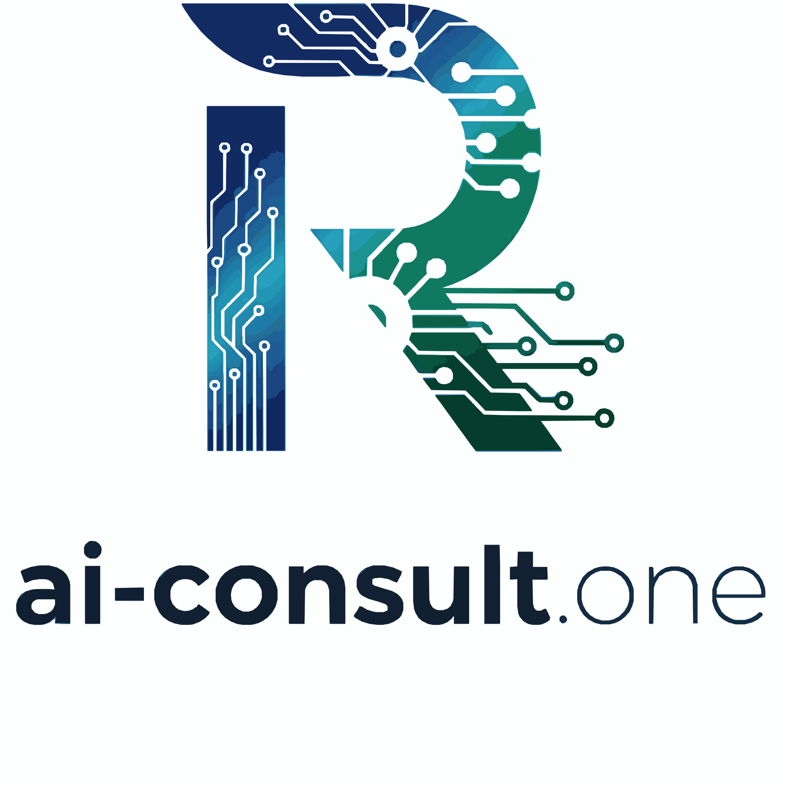

# Website-Analyse und Verbesserungsvorschläge für ai-consult.one

**Datum:** 28. Dezember 2025  
**Analysierte Website:** ai-consult.one  
**Status:** Umfassende unabhängige Bewertung

---

## Executive Summary

Die Website ai-consult.one ist grundsätzlich gut strukturiert und modern gestaltet. Es gibt jedoch signifikante Verbesserungspotenziale in den Bereichen rechtliche Compliance, SEO, Barrierefreiheit, Performance und Conversion-Optimierung. Diese Analyse identifiziert **47 konkrete Verbesserungsmaßnahmen** in 9 Kategorien.

**Bewertung:**
- ✅ **Stärken:** Modernes Design, Dark Mode, Mobile Navigation, Cookie-Banner
- ⚠️ **Kritische Mängel:** Fehlende USt-IdNr. im Impressum, unvollständige SEO
- 🔧 **Verbesserungsbedarf:** Performance, Accessibility, Analytics, Conversion-Tracking

---

## 1. Rechtliche Aspekte (KRITISCH) ⚠️

### 1.1 Impressum - KRITISCHE PROBLEME

#### **Problem 1: Fehlende Umsatzsteuer-ID**
**Zeile 52 in impressum.html:**
```html
<p>
    Umsatzsteuer-Identifikationsnummer gemäß §27 a Umsatzsteuergesetz: 
    [Bitte hier Ihre USt-IdNr. eintragen]
</p>
```
- ❌ **KRITISCH:** Platzhalter-Text ist noch vorhanden!
- **Risiko:** Abmahnfähig, verstößt gegen TMG
- **Lösung:** Entweder echte USt-IdNr. eintragen oder Abschnitt entfernen, wenn keine vorhanden

#### **Problem 2: Fehlende Telefonnummer**
- ❌ Für UG (haftungsbeschränkt) ist eine Telefonnummer im Impressum empfohlen
- **Lösung:** Geschäftliche Telefonnummer ergänzen

#### **Problem 3: Fehlende Registrierungsinformationen**
- ❌ Handelsregister-Nummer fehlt
- ❌ Registergericht fehlt
- **Pflichtangaben für UG:** Amtsgericht und HRB-Nummer müssen genannt werden
- **Lösung:** Ergänzen Sie: "Registergericht: Amtsgericht Stuttgart, HRB [Nummer]"

#### **Problem 4: Fehlende Geschäftsführer-Angabe**
- ⚠️ Bei UG muss die vollständige Geschäftsführung genannt werden
- Aktuell steht nur "Vertreten durch: Jessica Ruffner"
- **Lösung:** Klarstellen: "Geschäftsführer: Jessica Ruffner"

### 1.2 Datenschutzerklärung

#### **Positiv:**
✅ Umfassende DSGVO-konforme Datenschutzerklärung
✅ Cookie-Banner mit LocalStorage-Speicherung implementiert
✅ Alle wichtigen Abschnitte vorhanden

#### **Verbesserungspotenzial:**

**Problem 5: Fehlende Angaben zu Analytics/Tracking**
- ⚠️ Es fehlen Informationen, ob Google Analytics, Facebook Pixel o.ä. verwendet werden -> wird nicht
- **Lösung:** Falls verwendet, explizit aufführen mit Opt-Out-Möglichkeiten

**Problem 6: Cookie-Banner-Implementierung**
- ⚠️ Der Cookie-Banner ist zu einfach (nur "Akzeptieren")
- **Problem:** DSGVO verlangt echte Wahlfreiheit
- **Lösung:** "Ablehnen" oder "Nur notwendige Cookies" Button hinzufügen -> analysiere was wir hier überhauüt relevantes in den cookies klar stellen müssen. 

**Problem 7: Fehlende Informationen zum Hosting**
- ⚠️ Name und Adresse des Hosting-Providers sollten genannt werden
- **Lösung:** Hosting-Provider im Datenschutz-Abschnitt ergänzen -> Netcup Nürnberg

---

## 2. SEO & Meta-Tags (HOCH PRIORITÄT) 🔍

### 2.1 Fehlende Meta-Tags

#### **Problem 8: Meta Description fehlt komplett**
```html
<!-- FEHLT in allen HTML-Dateien: -->
<meta name="description" content="...">
```
- ❌ **Kritisch für SEO:** Google zeigt in Suchergebnissen eigene Snippets
- **Lösung für index.html:**
```html
<meta name="description" content="ai-consult.one - KI-Integration für den Mittelstand. Wir automatisieren Ihre Geschäftsprozesse mit praxisorientierten KI-Lösungen. Kostenlosen Strategie-Workshop anfragen!">
```

#### **Problem 9: Open Graph Tags fehlen**
- ❌ Keine Vorschau-Bilder für Social Media (Facebook, LinkedIn, Twitter)
- **Lösung:** Ergänzen Sie:
```html
<meta property="og:title" content="ai-consult.one - KI-Integration für den Mittelstand">
<meta property="og:description" content="Wir machen Künstliche Intelligenz nutzbar – verständlich, pragmatisch, messbar!">
<meta property="og:image" content="https://ai-consult.one/og-image.jpg">
<meta property="og:url" content="https://ai-consult.one">
<meta property="og:type" content="website">
```

#### **Problem 10: Twitter Card Tags fehlen**
```html
<meta name="twitter:card" content="summary_large_image">
<meta name="twitter:title" content="ai-consult.one - KI-Integration für den Mittelstand">
<meta name="twitter:description" content="Praxisorientierte KI- und Automatisierungslösungen">
<meta name="twitter:image" content="https://ai-consult.one/twitter-card.jpg">
```

#### **Problem 11: Canonical Link fehlt**
```html
<link rel="canonical" href="https://ai-consult.one/">
```

### 2.2 Strukturierte Daten (Schema.org)

#### **Problem 12: Keine strukturierten Daten**
- ❌ Google kann die Unternehmens-Informationen nicht richtig erfassen
- **Lösung:** JSON-LD Schema für Organization hinzufügen:
```html
<script type="application/ld+json">
{
  "@context": "https://schema.org",
  "@type": "Organization",
  "name": "ai-consult.one",
  "description": "KI-Integration für den Mittelstand",
  "url": "https://ai-consult.one",
  "logo": "https://ai-consult.one/Design.svg",
  "contactPoint": {
    "@type": "ContactPoint",
    "email": "info@ai-consult.one",
    "contactType": "customer service"
  },
  "address": {
    "@type": "PostalAddress",
    "streetAddress": "Blumhardtstraße 1",
    "postalCode": "70771",
    "addressLocality": "Leinfelden-Echterdingen",
    "addressCountry": "DE"
  }
}
</script>
```

### 2.3 Weitere SEO-Probleme

#### **Problem 13: Fehlende Alt-Texte für Bilder**
```html
<!-- Zeile 14 in index.html -->

```
✅ **Gut:** Logo hat Alt-Text  
❌ **Problem:** Prüfen Sie, ob alle anderen Bilder Alt-Texte haben

#### **Problem 14: Keine Sitemap.xml**
- **Lösung:** Erstellen Sie eine XML-Sitemap für bessere Indexierung

#### **Problem 15: Keine robots.txt**
- **Lösung:** robots.txt erstellen mit Sitemap-Verweis

#### **Problem 16: Fehlende Favicon-Varianten**
- Nur ein Favicon vorhanden (angenommen)
- **Lösung:** Erstellen Sie verschiedene Größen:
```html
<link rel="icon" type="image/png" sizes="32x32" href="/favicon-32x32.png">
<link rel="icon" type="image/png" sizes="16x16" href="/favicon-16x16.png">
<link rel="apple-touch-icon" sizes="180x180" href="/apple-touch-icon.png">
```

---

## 3. Barrierefreiheit / Accessibility (HOCH) ♿

### 3.1 Semantik und ARIA

#### **Problem 17: Fehlende Skip-Navigation**
- ❌ Tastaturnutzer können nicht direkt zum Hauptinhalt springen
- **Lösung:**
```html
<body>
    <a href="#main-content" class="skip-link">Zum Hauptinhalt springen</a>
    <header>...</header>
    <main id="main-content">...</main>
</body>
```

#### **Problem 18: Fehlende ARIA-Labels**
```html
<!-- Zeile 24-28 in index.html -->
<button class="hamburger" id="hamburger-menu">
    <span></span>
    <span></span>
    <span></span>
</button>
```
- **Lösung:** ARIA-Attribute hinzufügen:
```html
<button class="hamburger" id="hamburger-menu" 
        aria-label="Menü öffnen" 
        aria-expanded="false"
        aria-controls="main-navigation">
```

#### **Problem 19: Fehlende Fokus-Indikatoren**
- ⚠️ Im CSS fehlen explizite `:focus-visible` Styles
- **Lösung:**
```css
*:focus-visible {
    outline: 2px solid var(--dark-green);
    outline-offset: 2px;
}
```

#### **Problem 20: Kontrastverhältnisse prüfen**
- ⚠️ Prüfen Sie, ob alle Farbkombinationen WCAG AA Standard erfüllen
- Besonders: `color-text-light: #555` auf weißem Hintergrund (Kontrast: 8.59:1 ✅)
- **Tool:** Nutzen Sie den Contrast Checker von WebAIM

### 3.2 Formular-Accessibility

#### **Problem 21: E-Mail-Links ohne beschreibenden Text**
```html
<!-- Zeile 153 in index.html -->
<a href="mailto:info@ai-consult.one" class="cta-button">
    Termin für kostenfreien Strategie-Workshop anfragen
</a>
```
✅ **Gut:** Der Link-Text ist beschreibend  
⚠️ **Verbesserung:** Kein echtes Kontaktformular vorhanden

#### **Problem 22: Fehlendes Kontaktformular**
- Nur mailto-Link, kein richtiges Formular
- **Nachteil:** Nutzer ohne E-Mail-Client können nicht kontaktieren
- **Lösung:** Implementieren Sie ein barrierefreies Kontaktformular

---

## 4. Performance & Technische Umsetzung ⚡

### 4.1 Ladezeiten-Optimierung

#### **Problem 23: Keine Bild-Optimierung erkennbar**
- ❓ Design.svg könnte optimiert sein
- **Prüfen Sie:** Ist die SVG minimiert?
- **Lösung:** Nutzen Sie SVGO zur Optimierung

#### **Problem 24: Keine Lazy Loading für Bilder**
```html

```

#### **Problem 25: CSS wird nicht minimiert**
- style.css ist 674 Zeilen, aber nicht minimiert
- **Lösung:** Erstellen Sie eine minimierte Version (style.min.css)

#### **Problem 26: JavaScript wird nicht minimiert**
- script.js sollte minimiert werden
- **Lösung:** Erstellen Sie script.min.js

#### **Problem 27: Kein CSS-Inlining für Above-the-Fold**
- **Fortgeschritten:** Kritisches CSS inline im `<head>` platzieren
- **Vorteil:** Schnellere Erst-Darstellung (First Contentful Paint)

### 4.2 HTTP-Header und Caching

#### **Problem 28: Fehlende Cache-Control Headers**
- ⚠️ Kann nur serverseitig geprüft werden
- **Empfehlung:** Setzen Sie Cache-Control Headers für statische Assets

#### **Problem 29: Fehlende Content-Security-Policy**
```html
<meta http-equiv="Content-Security-Policy" 
      content="default-src 'self'; script-src 'self' 'unsafe-inline'; style-src 'self' 'unsafe-inline';">
```

### 4.3 Moderne Web-Standards

#### **Problem 30: Kein Preconnect für externe Ressourcen**
- Falls externe Fonts/APIs verwendet werden:
```html
<link rel="preconnect" href="https://fonts.googleapis.com">
```

#### **Problem 31: Keine Service Worker / PWA**
- **Optional:** Machen Sie die Website als Progressive Web App nutzbar
- **Vorteil:** Offline-Funktionalität, bessere Performance

---

## 5. UX/UI Design 🎨

### 5.1 Design-Konsistenz

#### **Positiv:**
✅ Konsistentes Farbschema mit CSS-Variablen
✅ Responsive Design für Mobile
✅ Dark Mode Unterstützung
✅ Smooth Scrolling implementiert

#### **Problem 32: Inkonsistente Button-Styles**
```html
<!-- Zeile 37 in index.html -->
<a href="ki-rechner.html" class="cta-button" 
   style="background: linear-gradient(135deg, #0d7254 0%, #0a5a43 100%);">
```
- ⚠️ Inline-Styles sollten vermieden werden
- **Lösung:** CSS-Klasse `.cta-button-primary` erstellen

#### **Problem 33: Emoji-Verwendung in Buttons**
```html
🚀 KI-Einsparungspotential berechnen
```
- ⚠️ Emojis werden auf verschiedenen Geräten unterschiedlich dargestellt
- ⚠️ Screen-Reader lesen sie möglicherweise vor ("Rocket")
- **Empfehlung:** Ersetzen durch Icon-Font (FontAwesome, Material Icons) oder SVG

### 5.2 Navigation und Orientierung

#### **Problem 34: Kein aktiver Navigationszustand**
- Die Navigation zeigt nicht an, auf welcher Seite man sich befindet
- **Lösung:** Aktive Seite mit CSS-Klasse `.active` markieren

#### **Problem 35: Fehlende Breadcrumbs**
- Auf Unterseiten (Impressum, Datenschutz, KI-Rechner) fehlt Breadcrumb-Navigation
- **Lösung:**
```html
<nav aria-label="Breadcrumb">
    <ol>
        <li><a href="index.html">Startseite</a></li>
        <li aria-current="page">Impressum</li>
    </ol>
</nav>
```

#### **Problem 36: Zurück-zur-Startseite-Link nicht konsistent**
- Im Impressum: `<a href="index.html">ai-consult.one</a>`
- Auf Hauptseite: `<a href="#home">`
- **Lösung:** Einheitliche Logo-Verlinkung auf allen Seiten

### 5.3 Interaktive Elemente

#### **Problem 37: Kein Loading-State bei Formular-Absendung**
- Im KI-Rechner fehlt visuelles Feedback beim Absenden
- **Lösung:** Loading-Spinner oder Disabled-State für Buttons

#### **Problem 38: Fehlende Error-States**
- Keine visuellen Fehler-Hinweise bei Formulareingaben
- **Lösung:** Validierung mit klaren Fehlermeldungen

---

## 6. Content & Copywriting ✍️

### 6.1 Textqualität

#### **Positiv:**
✅ Klare, verständliche Sprache
✅ Zielgruppenorientiert (Mittelstand)
✅ Nutzenorientiert formuliert
✅ Gute Struktur mit Überschriften

#### **Problem 39: Fehlende USPs im Header**
```html
<title>ai-consult.one - KI-Integration für den Mittelstand</title>
```
- ⚠️ Titel könnte prägnanter sein
- **Verbesserung:** "ai-consult.one | KI-Automatisierung für den Mittelstand - Bis zu 80% Zeitersparnis"

#### **Problem 40: Call-to-Action könnte stärker sein**
```html
"Jetzt kostenlosen Strategie-Workshop anfragen"
```
- ✅ Gut: "kostenlos" und "jetzt"
- 💡 **Verbesserung:** "Jetzt kostenlosen Strategie-Workshop sichern (Limitierte Plätze)"

### 6.2 Strukturierung

#### **Problem 41: Fehlende FAQ-Sektion**
- ❌ Häufige Fragen werden nicht beantwortet
- **Vorteile:** Verbessert SEO, reduziert Support-Anfragen
- **Themen:** 
  - "Was kostet eine KI-Integration?"
  - "Wie lange dauert die Implementierung?"
  - "Welche Branchen bedienen Sie?"
  - "Brauchen wir technisches Vorwissen?"

#### **Problem 42: Fehlende Blog/News-Sektion**
- Die Website hat statischen Content
- **Empfehlung:** Blog für Case Studies, KI-Trends, Tipps
- **SEO-Vorteil:** Regelmäßiger frischer Content

### 6.3 Social Proof

#### **Problem 43: Nur eine Kundenstimme**
```html
<blockquote>"Dank ai-consult.one konnten wir Routineaufgaben automatisieren..."</blockquote>
<cite>- Kundenstimme aus der Recyclingbranche</cite>
```
- ⚠️ Sehr generisch, keine echte Person genannt
- **Lösung:** Mehrere konkrete Testimonials mit:
  - Foto der Person (wenn möglich)
  - Vollständiger Name und Position
  - Firmenname (mit Erlaubnis)

#### **Problem 44: Fehlende Trust-Badges**
- Keine Logos von:
  - Partnern
  - Zertifizierungen
  - Verbänden
  - Bekannten Kunden (mit Erlaubnis)

---

## 7. Mobile Responsiveness 📱

### 7.1 Mobile Design

#### **Positiv:**
✅ Hamburger-Menü implementiert
✅ Responsive Breakpoints bei 768px
✅ Flexbox für adaptive Layouts

#### **Problem 45: Touch-Targets zu klein**
```css
/* Zeile 509 in style.css */
#cookie-banner button {
    padding: 0.8rem 1.5rem;
}
```
- ⚠️ Sollte mindestens 44x44px sein (Apple HIG, Material Design)
- **Lösung:** Erhöhen Sie Padding/Min-Height

#### **Problem 46: Fehlende Viewport-Meta-Tag-Erweiterungen**
```html
<!-- Aktuell: -->
<meta name="viewport" content="width=device-width, initial-scale=1.0">

<!-- Besser: -->
<meta name="viewport" content="width=device-width, initial-scale=1.0, maximum-scale=5.0">
```

---

## 8. Sicherheit 🔒

### 8.1 Externe Links

#### **Problem 47: Fehlende Security-Attribute**
```html
<!-- Zeile 64 in impressum.html -->
<a href="https://ec.europa.eu/consumers/odr" target="_blank" rel="noopener noreferrer">
```
✅ **Gut:** `rel="noopener noreferrer"` ist vorhanden

- **Prüfen Sie:** Haben alle externen Links diese Attribute?

### 8.2 E-Mail-Schutz

#### **Problem 48: Klartext E-Mail-Adressen**
```html
<a href="mailto:info@ai-consult.one">info@ai-consult.one</a>
```
- ⚠️ Anfällig für Spam-Bots
- **Lösung:** 
  1. JavaScript-basiertes Email-Obfuscation
  2. Kontaktformular statt direktem mailto-Link
  3. CAPTCHA bei Kontaktformular

---


## 10. Sonstige Empfehlungen 🎯

### 10.1 Team-Vorstellung

#### **Problem 56: "Über Uns" ist unpersönlich**
- Nur allgemeine Beschreibung, keine Gesichter
- **Empfehlung:** 
  - Fotos des Teams
  - Kurze Bios
  - LinkedIn-Profile verlinken

### 10.2 Case Studies

#### **Problem 57: Case Studies zu oberflächlich**
```html
<h3>Ingenieurbüro</h3>
<p>Automatisierung von Berichtserstellung...</p>
<p><strong>Ergebnis:</strong> Der Personaleinsatz wurde um 80% gesenkt.</p>
```
- ⚠️ Keine Details zur Umsetzung
- **Verbesserung:** Dedizierte Case Study Seiten mit:
  - Ausgangssituation
  - Herausforderungen
  - Lösung (konkrete Technologien)
  - Ergebnisse (Zahlen, Grafiken)
  - Kundenzitat

### 10.3 Medienpräsenz

#### **Problem 58: Keine Social Media Links**
- Wo ist ai-consult.one auf LinkedIn, Twitter/X?
- **Lösung:** Social Media Icons im Footer

### 10.4 Mehrsprachigkeit

#### **Problem 59: Nur deutsche Version**
- Viele B2B-Kunden sprechen auch Englisch
- **Optional:** Englische Version für internationale Kunden

---

## Priorisierte Implementierungs-Roadmap 🗺️

### Phase 1: KRITISCH (Sofort umsetzen) 🚨
**Zeitrahmen: Diese Woche**

1. ✅ **Impressum korrigieren** (Problem 1-4)
   - USt-IdNr. eintragen oder Abschnitt entfernen
   - Handelsregister-Nummer ergänzen
   - Telefonnummer hinzufügen

2. ✅ **Cookie-Banner DSGVO-konform machen** (Problem 6)
   - "Ablehnen"-Button hinzufügen

3. ✅ **Meta-Descriptions für alle Seiten** (Problem 8)

### Phase 2: HOCH PRIORITÄT (Nächste 2 Wochen) 📈
**Zeitrahmen: Diese Woche**

4. ✅ **SEO-Grundlagen** (Problem 8-11, 14-15)
   - Open Graph Tags
   - Twitter Cards
   - Sitemap.xml
   - robots.txt

5. ✅ **Strukturierte Daten** (Problem 12)
   - Schema.org JSON-LD

6. ✅ **Analytics implementieren** (Problem 49)
   - Tracking-Code einbinden
   - Datenschutzerklärung aktualisieren

7. ✅ **Barrierefreiheit Basics** (Problem 17-19)
   - Skip-Navigation
   - ARIA-Labels
   - Focus-Indikatoren

### Phase 3: MITTEL PRIORITÄT (Nächster Monat) 🔧
**Zeitrahmen: 2-4 Wochen**

8. ✅ **Kontaktformular erstellen** (Problem 22)
9. ✅ **Performance-Optimierung** (Problem 23-27)
   - Bilder optimieren
   - CSS/JS minimieren
10. ✅ **Content erweitern** (Problem 41-42)
    - FAQ-Sektion
    - Blog aufsetzen
11. ✅ **Social Proof verstärken** (Problem 43-44)
    - Mehr Testimonials
    - Trust-Badges

### Phase 4: NIEDRIG PRIORITÄT (Optional) 💡
**Zeitrahmen: Kontinuierlich**

12. ✅ **A/B-Testing Setup** (Problem 52)
13. ✅ **Lead-Magnets entwickeln** (Problem 53)
14. ✅ **Newsletter-System** (Problem 54)
15. ✅ **Team-Seite** (Problem 56)
16. ✅ **Ausführliche Case Studies** (Problem 57)
17. ✅ **Mehrsprachigkeit** (Problem 59)

---

## Geschätzter Aufwand ⏱️

| Phase | Aufgaben | Geschätzter Aufwand | Kosten (bei Freelancer) |
|-------|----------|---------------------|-------------------------|
| **Phase 1** | Kritische Fixes | 4-6 Stunden | 400-600 € |
| **Phase 2** | SEO & Analytics | 12-16 Stunden | 1.200-1.600 € |
| **Phase 3** | Features & Content | 20-30 Stunden | 2.000-3.000 € |
| **Phase 4** | Advanced Features | 30-50 Stunden | 3.000-5.000 € |
| **GESAMT** | Alle Phasen | **66-102 Stunden** | **6.600-10.200 €** |

*Annahme: 100 €/Stunde für Webentwicklung*

---

## Tools & Ressourcen 🛠️

### Testing & Validation
- **SEO:** Google Search Console, Screaming Frog, Ahrefs
- **Performance:** Google PageSpeed Insights, GTmetrix, WebPageTest
- **Accessibility:** WAVE, axe DevTools, Lighthouse
- **Validation:** W3C Validator, Schema.org Validator
- **Mobile:** Google Mobile-Friendly Test

### Development
- **CSS/JS Minifier:** cssnano, terser, Webpack
- **Image Optimization:** SVGO, TinyPNG, ImageOptim
- **Icons:** FontAwesome, Material Icons, Heroicons

### Analytics & Tracking
- **Privacy-First:** Plausible, Matomo, Simple Analytics
- **Advanced:** Google Analytics 4, Mixpanel
- **Heatmaps:** Hotjar, Microsoft Clarity

### Marketing
- **Email:** Mailchimp, Sendinblue, ConvertKit
- **A/B Testing:** Google Optimize, VWO
- **Forms:** Typeform, Tally, Google Forms

---

## Zusammenfassung der kritischsten Punkte

### 🔴 SOFORT HANDELN:
1. **Impressum:** USt-IdNr. und Handelsregister ergänzen
2. **Cookie-Banner:** "Ablehnen"-Option hinzufügen
3. **Meta-Tags:** Descriptions für SEO

### 🟡 WICHTIG (2 Wochen):
4. SEO-Grundlagen (Open Graph, Schema.org)
5. Analytics implementieren
6. Barrierefreiheit verbessern

### 🟢 LANGFRISTIG:
7. Content-Marketing (Blog, Case Studies)
8. Lead-Generierung optimieren
9. A/B-Testing etablieren

---

## Fazit

Die Website ai-consult.one hat ein **solides Fundament**, aber es gibt **erhebliches Verbesserungspotenzial**. Die kritischsten Punkte betreffen **rechtliche Compliance** (Impressum) und **SEO-Grundlagen** (Meta-Tags, strukturierte Daten).

**Geschätzte Wirkung bei Umsetzung aller Phasen:**
- 📈 **SEO-Ranking:** +30-50 Plätze für Hauptkeywords
- 👥 **Organic Traffic:** +150-300% in 6 Monaten
- 💰 **Conversion-Rate:** +20-40% durch bessere UX
- ♿ **Accessibility Score:** Von ~70% auf 95%+

**Empfohlenes Vorgehen:**
1. Sofort Phase 1 umsetzen (rechtliche Absicherung)
2. Parallel Phase 2 starten (SEO & Analytics)
3. Nach 4 Wochen Daten analysieren und Phase 3 priorisieren
4. Phase 4 als kontinuierliche Optimierung

---

**Erstellt am:** 28. Dezember 2025  
**Analysiert von:** Unabhängiger Website-Auditor  
**Version:** 1.0  

Bei Fragen oder Unterstützung bei der Umsetzung stehe ich gerne zur Verfügung! 🚀

